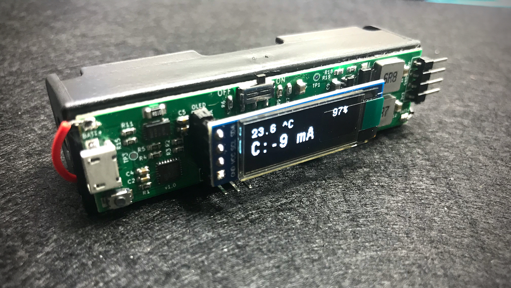

# 18650 Manager

<p align="center"> 

</p>

18650 Manager is an all-in-one single-cell LiPo battery manager. It's a battery charger, battery monitor and a dual rail power supply (3.3V and 5V). You can use it with any kind of single-cell LiPo battery, but it's designed with a form factor to be attached on back of an 18650 battery box, so you can use it as a Power Bank for your projects.

This repository contains board schematic and sample code installed by default.

<a href="https://www.tindie.com/stores/manuat/?ref=offsite_badges&utm_source=sellers_manuAT&utm_medium=badges&utm_campaign=badge_medium"></a>

## Battery Charger
Battery charging is managed by a bq24075 IC from Texas Instruments. You can select the maximum charge current through the DIP switch, with the following configurations.

| PIN 1 | PIN 2 | Max. Current |
| :-: | :-: | :-: |
| Down | Down | Standby (USB suspend mode) |
| Up | Down | 1A. |
| Down | Up | 500 mA. USB500 mode |
| Up | Up | 100 mA. USB100 mode |

## Fuel Gauge
The board features a BQ27441-G1A fuel gauge from Texas Instruments, based on Impedance Track™ Technology, that accurately predicts the battery capacity and other operational characteristics.

When powered on, the IC is in sleep mode so you have to wait some seconds before the accurate data is displayed on screen. 

If there is no load on output pins, the display reflects the actual consumption by the MCU and the OLED display (see image on top of the page). Keep it in mind when measuring data with a load connected to output.

## IDE Environment
The sorce code is generated from [STM32CubeIDE][cubeIDE link]. For a different IDE, you can open the .ioc file with STM32CubeMX, change the Toolchain / IDE selection from the Project Manager tab and generate the new project structure. In this scenario is better to copy the .ioc file to a new folder before generating the project.


## How sample works

This sample code uses two different I2C bus interfaces: hi2c1 to interrogate the fuel gauge IC, and hi2c2 to display the data in a 0.91" OLED display. 

#### Battery configuration
Once all peripherals are configured, the fuel gauge IC must be configured according to your battery specs. That is: **Design Capacity** (the mAh value of the battery), **Design Energy**, **Termination Voltage** (value that represents 0%) and **Taper Rate**.

```c
BQ27441_G1_Setup(&bq27441_g1, 3400, 3200);
```

Second parameter (3400) represents the design capacity of the battery. The last parameter is the termination voltage. Design Energy and Taper Rate are calculated based on these values.

#### Button functionality
Pressing the button triggers an interrupt that changes the current mode, so it can be readed by the main loop to know wich info should be displayed.

This is the information displayed on the screen:

- State Of Charge (in %, always visible)
- Temperature (in ºC, always visible)
- Average Current (C, in mA)
- Average Power (P, in mW)
- Remaining Capacity (R.C., in mA)
- Battery Voltage (V, in mV)
- Design Capacity (D.C., in mA)
- Full-Charge Capacity (F.C., in mA)
- State Of Health (HLTH, in %)


[cubeIDE link]: https://www.st.com/en/development-tools/stm32cubeide.html


